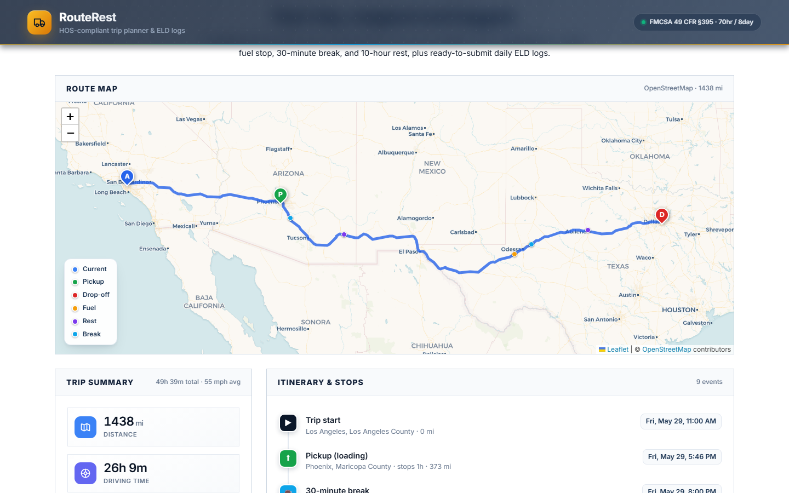
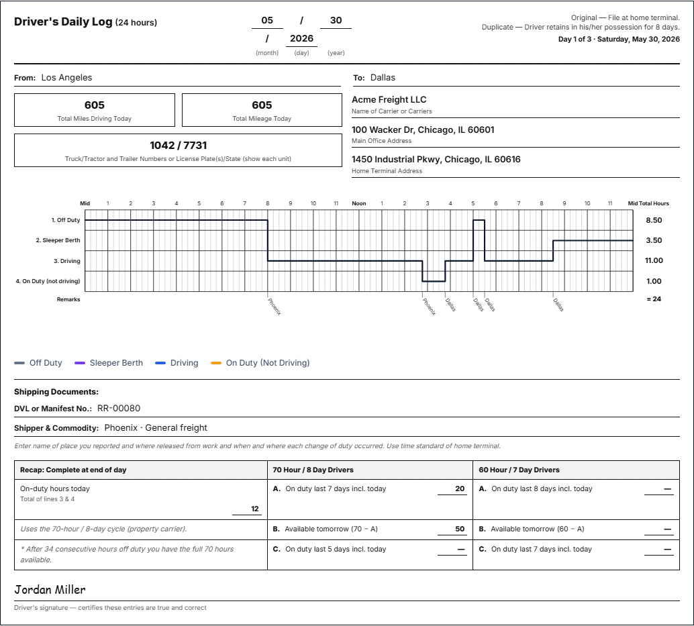

<div align="center">

# RouteRest

**Plan the drive. Stay inside the hours. Print the logs.**

A Django + React trip planner for U.S. property-carrying drivers on the
federal 70-hour / 8-day Hours-of-Service cycle.

[Live demo](https://route-rest.vercel.app/)
·
[Source](https://github.com/superdev0925/Route_Rest)

</div>

---

```
  current ──► pickup ──► drop-off
                 │
                 ▼
     map · directions · stops · daily ELD sheets
```

Four inputs. A full interstate plan: route geometry, required fuel and rest,
turn-by-turn instructions, and one filled FMCSA *Driver's Daily Log* per
calendar day.

| Input | Output |
| --- | --- |
| Current location | Interactive map with start, pickup, drop-off, fuel, breaks, rests |
| Pickup location | Turn-by-turn driving instructions (OSRM) |
| Drop-off location | Itinerary with arrival time and trip miles |
| Current cycle used (0–70 h) | Drawn, printable daily log sheets — several on long hauls |

---

## Preview

| Planning | Route & itinerary | Daily log |
| :---: | :---: | :---: |
|  |  |  |

Try the built-in samples on the live site: **Short haul**, **Midwest**, or
**Cross-country** (Los Angeles → Denver → Chicago) to see multiple log days.

---

## Hours of Service

The engine follows the assessment profile: property-carrying CMV, 70/8,
no adverse-conditions exception. Driving time is estimated at **55 mph**.
Each log sheet is padded so the grid totals **24 hours**.

| Limit | How RouteRest applies it |
| --- | --- |
| 11-hour driving | Caps a shift, then a 10-hour sleeper rest |
| 14-hour window | Clock starts at first work; no driving after hour 14 |
| 30-minute break | Required after 8 hours of driving. Fuel, loading, or unloading (≥ 30 min on duty) counts; otherwise an off-duty stop is inserted |
| 70-hour / 8-day | Remaining hours come from the form. A 34-hour restart is added if the trip would exceed 70 |
| Fuel | On-duty stop at least every 1,000 miles |
| Pickup / drop-off | 1 hour on duty each |

This is a planning aid, not legal HOS advice.

---

## Stack

| Layer | Choice |
| --- | --- |
| API | Django 5, Django REST Framework, SQLite (Postgres via `DATABASE_URL`) |
| UI | React 18, Vite, Leaflet |
| Geo | Photon (autocomplete), Nominatim (geocode), OSRM public demo (routing) |
| Hosting | Vercel (frontend), Render or any WSGI host (backend) |

No paid map keys. Nominatim requires a descriptive User-Agent in production.

```
React  ──POST /api/plan/──►  Django
  │                            │
  │                            ├─ Nominatim × 3
  │                            ├─ OSRM  current → pickup → drop-off
  │                            └─ HOSPlanner  → Trip.plan JSON
  ▼
map · directions · compliance · SVG logs
```

---

## Run locally

**Backend** — http://127.0.0.1:8000

```bash
cd backend
python -m venv venv
venv\Scripts\activate          # macOS / Linux: source venv/bin/activate
pip install -r requirements.txt
python manage.py migrate
python manage.py runserver
```

**Frontend** — http://127.0.0.1:5173

```bash
cd frontend
npm install
npm run dev
```

The UI talks to `http://127.0.0.1:8000` unless you set `VITE_API_URL`.
Copy `backend/.env.example` and `frontend/.env.example` only if you need
overrides.

---

## Project layout

```
backend/trips/services/hos_planner.py   HOS simulation
backend/trips/services/routing.py       OSRM + turn-by-turn
backend/trips/services/geocoding.py     Photon / Nominatim
backend/trips/views.py                  POST /api/plan/  GET /api/geocode/
frontend/src/components/LogSheet.jsx    FMCSA grid
frontend/src/components/RouteMap.jsx    Leaflet route + stops
```

---

<div align="center">

FMCSA 49 CFR Part 395 · property carrier · 70 hr / 8 day

</div>
